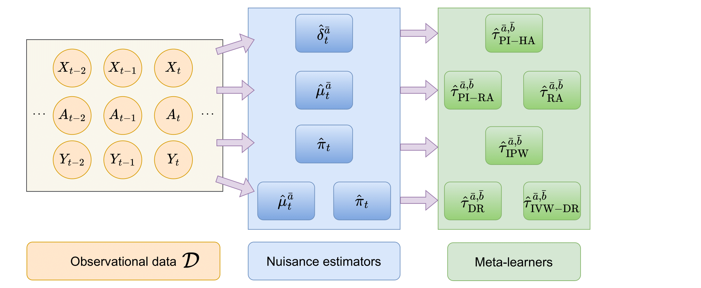

# CATEMetaLearnersTime

This repository contains the code for our paper "Model-agnostic meta-learners for estimating heterogeneous treatment effects over time".

#### Project structure 
- *data* contains the data generation files/ real-world data preprocessing
- *experiments* contains the code to run the experiments and the results, trained models, and hyperparameters
- *models* contains code for the transformer architecture
- *results* contains code for reproducing the plot from Fig. 3

#### Requirements
The project uses the packages listed in the file `requirements.txt`. 

#### Reproducing the experiments
The scripts running the experiments are contained in the `/experiments` folder. Each experimental setting is contained within its own subfolder. These are:
- `/sim_overlap`: experiments for dataset 3 (Fig. 3). Several folders contain results for different values of gamma (overlap parameter).
- `/sim_propensity`: experiments for dataset 1 (Table 2). Several folders contain results for different values of tau (forecast horizon).
- `/sim_response`: experiments for dataset 2 (Table 3). Several folders contain results for different values of tau (forecast horizon).

The file *run.py* executes the experiments. Configuration settings are in *config.yaml*. By default, the pre-trained models in `/saved_models` will be used to estimate bounds. Hyperparameters are stored in `/model_configs`. For model training, the parameters *train_propensity*, *train_response_functions*, and *train_history_adjustments*  in *train_meta_learners* can be changed to *True*.
